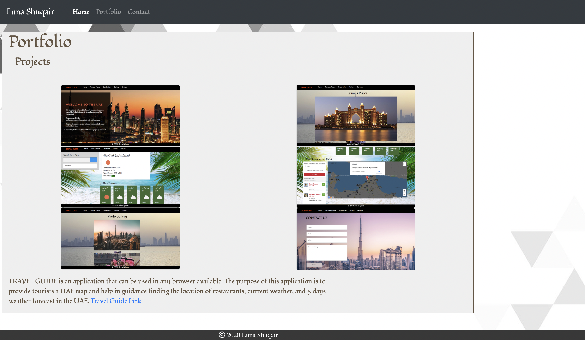

# Homework2
A web-application can be used in any browser available. The application has information about myself that contains about me page, a portfolio page about my projects, and a contact page that let users contact with me. 

### Technologies Used
- HTML
- CSS

## LINK TO THE REPOSITORY

- The link is [Homework2](https://github.com/LShuqair/Homework2)

## LINK TO THE WEBSITE
- The link is [Homework2](file:///Users/lunashuqair/Desktop/Homework/Homework2/index.html)

## SCREENSHOTS

